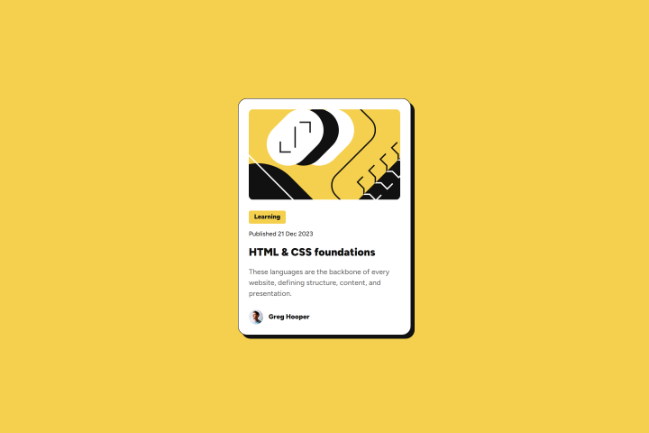
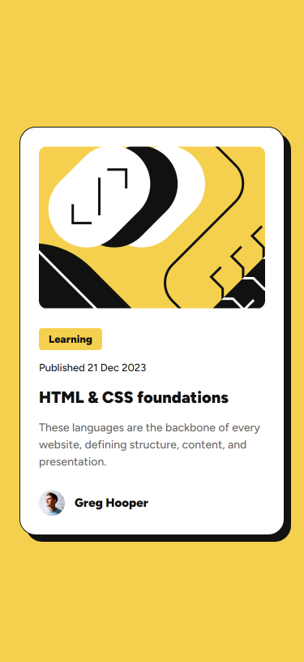

# Blog Preview Card

This is a solution to the Frontend Mentor blog preview card challenge built using React and Sass.

## Table of Contents

- [Why I Built This Project](#why-i-built-this-project)
- [Preview]()
  - [Desktop](#desktop)
  - [Mobile](#mobile)
- [Author](#author)

## Why I Built This Project

I decided to build this simple project to both practice my React and Sass skills, and also to gain more experience with building responsive layouts that adapt to different screen sizes.

## Preview

### Desktop

### Mobile

## Author

- [Frontend Mentor](https://www.frontendmentor.io/profile/VenusY)
- [GitHub](https://github.com/VenusY)